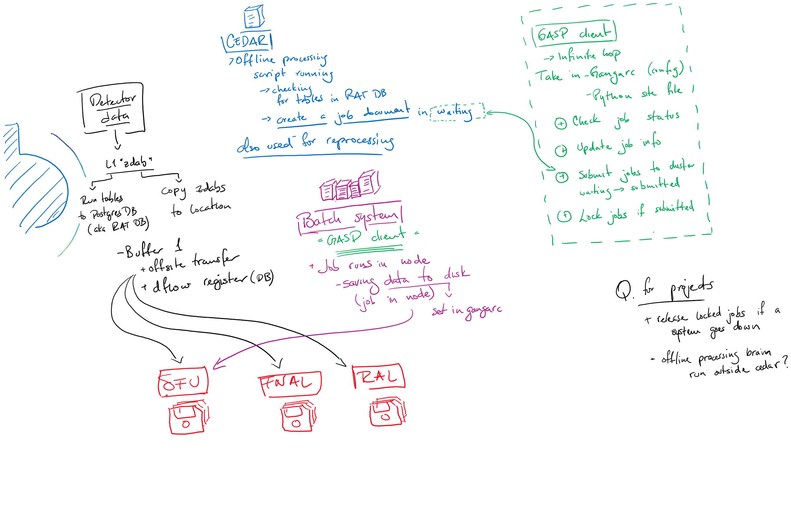

# **Processing Overview**

This is a high-level overview of the steps that data takes to be processed, starting from retrieval at the detector, all the way to the final storage of it. An infographic is supplied at the bottom of the page (courtesy of Juan Pablo Yanez) that will hopefully help visualize this flow of data.

---

## **Raw Data**
1. The detector takes data at SNOLAB
2. This data is processed immediately **onsite** (which is now referred to as **L1 data**) to create the required **run tables** (tables containing the information about the state of the detector at the time of data retrieval) for the rest of the processing chain
3. A machine at SNOLAB called **buffer1** runs screen sessions of `dflow_register.py` and `offsite_transfers.py` to create documents for the raw data in CouchDB and register them to the grid, and then transfer them to the primary site (at the time of writing, this is **SFU**)
4. Once this L1 data is ready to be processed (using the **second pass processing macro** which is commonly called the **processing module**), `offline_processing.py` will create job documents for the runs that are ready and mark those jobs as "waiting"
5. The `gasp_client.py` also runs in a screen session infinitely (the **enqueue_processing** screen tab) and it does the following:
  * **Monitor** the status of jobs and updates the job documents in CouchDB
  * **Submit** jobs when they are able to run
  * **Reset** jobs if they are stuck
  * **Locks** jobs to a specific site (this is allocating jobs to the **farm document**)
6. The **enqueue_processing** screen tab will flip between two commands:
  * Update the **job status** in **Ganga** (a unified backend job submission system; this can access job information directly from sites - ex. Slurm/Condor etc) and store the job information
  * Update the **job documents** on CouchDB using that stored Ganga job information
7. (Continued from 4.) Once the `gasp_client.py` notices a waiting job, it will utilize Ganga and our tools (in `data-flow/gasp/GangaSNOplus`) to package all necessary scripts and tools to run the job on the specified site (backend)
8. Jobs will get submitted to a specific site, and the **enqueue_processing** screen takes over to monitor it
9. When a job's status is "completed", the output data will be saved on the specified Grid **storage element** (or **SE** for short; ex. lcg-snopse1 which is at SFU)
10. **Third pass processing** (the "Analysis" module) is submitted once its pre-requisite processing run has completed

---

## **Reprocessing**
If it is decided that a certain set of runs is unusable for analysis (ex. mistaken RAT version) then the runs **must** be reprocessed with a new version of RAT.

1. Instead of automatic processing, run `offline_processing.py` **on the command line** (NO screen) with the desired RAT version, run(s), and module(s)
2. From here, it is the same as the **raw data** processing chain above at step 7.

---

## **Visualization of the Processing chain**

